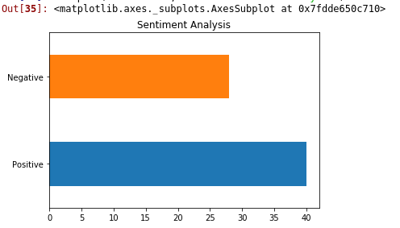

# Sentimental-Analysis-using-Logistic-Regression
Twitter sentimental analysis using logistic regression with apache hadoop ecosystem

This Projects is designed to analyse positive and negative emotions from the text.For this project algorithm is firstly trained with the already provided data that is categorized by human itself for positive and negative emotions.

<b>Accuracy of this algorithm is 84.75%</b> for the first time.And it's accuracy will be continously improved.Becuase, Algorithm written for this project is itself a <b>self learning algorithm </b>, it  will automatically improve itself day by day.

## Sentimental Analysis
Sentiment analysis refers to the use of natural language processing, text analysis, computational linguistics, and biometrics to systematically identify, extract, quantify, and study affective states and subjective information. Sentiment analysis is widely applied to voice of the customer materials such as reviews and survey responses, online and social media, and healthcare materials for applications that range from marketing to customer service to clinical medicine. 

## Twitter
Twitter is an American online news and social networking service on which users post and interact with messages known as "tweets".

# Steps
<ul>
  <li>Fetching Data</li>
  <li>Writing Text Classifier
    <ul>
      <li>Bag of Words Model(BOW)</li>
      <li>TF-IDF Model (Term Frequency and Inverse Term Frequency)</li>
      <li>Training our classifier using Logistic Regression</li>
      <li>Unpickling the classifier and vectorizer</li>
    </ul>   
  </li>
  <li>Mapper
    <ul>
      <li>Stream dataset</li>
      <li>Pickling the classifier and vectorizer</li>
      <li>Preprocessing the dataset</li>
      <li>Transform and Pridict</li>
    </ul>
  </li>
  <li>Reducer</li>
  <li>Visualize</li>
  </ul>
  
  ## Result
   </img>
  
  ## Applications
  <ul>
  <li>Forex Trading</li>
  <li>Investor's portfolio for prediction</li>
  <li>To arrive at happiness index of the customers</li>
  <li>Determining product recommendations</li>
  <li>Predicting Stock market moods</li>
  <li>As a competitive marketing tool</li>
  </ul>
  
  ## Future Scope
  This project can be modified to detect feelings and emotions (angry, happy, sad, etc) or identify intentions (e.g. interested v. not interested). It just requires the data for the same to be trained.
